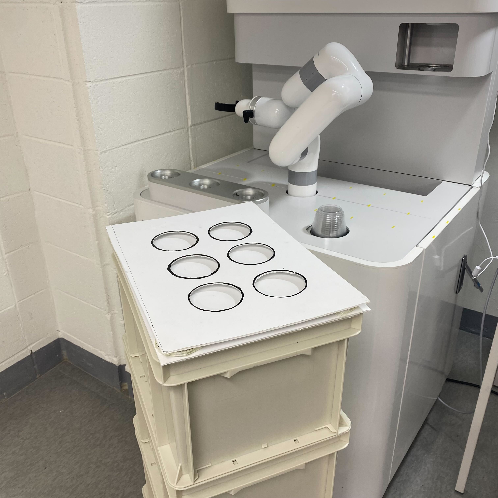

🍦 ARIS/STORAGE Project
===
AI 비전과 다중로봇 제어를 활용한 아이스크림 제조 및 서빙 자동화
---

### 🔨 개발환경
본 프로젝트는 Ubuntu 22.04 (ROS2 humble) 환경에서 개발되었습니다.   
&nbsp;

### 🦾 작업공간
</img>   
&nbsp;

### 💻 코드 실행

#### **robot motion**
code: [motion3.py](aris_pkg/aris_pkg/motion3.py)
```bash
ros2 run aris_pkg motion3
```
&nbsp;

### 📷 시연 영상
https://youtu.be/z3UYvFTg2U8

---

&nbsp;

## 목차

#### [1. 📘 프로젝트 개요](#1--프로젝트-개요-1)   
#### [2. 👥 프로젝트 팀 구성 및 역할분담](#2--프로젝트-팀-구성-및-역할분담-1)   
#### [3. 🗓 프로젝트 구현 일정](#3--프로젝트-구현-일정-1)   
#### [4. 📌 SKILLS](#4--skills-1)   
#### [5. 🤖 Hardware](#5--hardware-1)   
#### [6. ⚒️ System Architecture](#6-%EF%B8%8F-system-architecture-1)   
#### [7. 🎬 System Flow](#7--system-flow-1)   
#### [8. ✨ 주요 기능](#8--주요-기능-1)   
#### [9. 🔍 프로젝트 기대효과](#9--프로젝트-기대효과-1)   

---

&nbsp;

## 1. 📘 프로젝트 개요
아이스크림 매장에서 AI비전과 매니퓰레이터를 활용한 아이스크림 제조, 자율주행로봇을 활용한 서빙을 자동화하는 프로젝트입니다.   
</img>   

&nbsp;

## 2. 👥 프로젝트 팀 구성 및 역할분담
| 이름 | 역할 |
|------|------|
| 임용진 (팀장) | 프로젝트 계획 수립 |
| 박정한 | GUI 소프트웨어 구현, DATABASE 구현, 로봇팔 동작 구현, ROS2 통신 노드 구성 |
| 이재혁 | 경로주행 노드 구현, ROS2 통신 시스템 구축 및 통합, 전체 시스템 통합, Storagy 주행제어, 얼굴인식 개발 |
| 백홍하 | 로봇팔(ARIS) 동작 구현, YOLO 객체인식(캡슐, 로봇암, 사람 등) 구현, 객체 좌표 변환 |
| 이성민 | GUI 소프트웨어 구현, Storagy 주행제어, 로봇암 좌표 변환 구현 |
| 이혁진 | Storagy 주행제어, 프로젝트 산출물 자료 정리, 얼굴인식 개발 |

&nbsp;

## 3. 🗓 프로젝트 구현 일정
**진행 일자: 24.07.01(월) ~ 24.08.29(목) (58일)**
</img>

&nbsp;

## 4. 📌 SKILLS
</img>   

&nbsp;

## 5. 🤖 Hardware
</img>

&nbsp;

## 6. ⚒️ System Architecture
</img>

&nbsp;

</img>

&nbsp;

## 7. 🎬 System Flow
</img>

&nbsp;

## 8. ✨ 주요 기능

### 0. YOLO 커스텀 데이터셋 제작
- 객체 별 기능   
</img>

- 데이터셋 라벨링 및 모델 학습 (Object Detection / Instance Segmentation)

| 라벨링 과정 | 웹캠 객체인식 화면 |
|--|--|
|  |  |

&nbsp;
### 1. 캡슐 인식   
- 3개의 ROI 구역 설정 → 구역 내에 캡슐 인식 시 로봇 동작   

| A Zone | B Zone | C Zone |
|--|--|--|
|  |  |  |

- 캡슐이 다른 ROI 구역을 지나면 그 구역에 캡슐을 올려 놓았다고 인식되는 문제 발생
  - 캡슐이 구역 내에서 인식된 상태로 일정 시간(2초)이 지나야 로봇이 동작하도록 수
 
| 개선 전 | 개선 후 |
|--|--|
|  |  |

&nbsp;
### 2. 객체인식을 이용한 스티커 제거 여부 판단   
- ROI 구역 설정
  - 캡슐을 집고 뒤집어 밑면을 확인 → 스티커를 제거했는지 여부 인식
  - 인식하지 못하면 캡슐을 다시 돌려놓음
  - 구역 내에 스티커 제거한 캡슐 인식 시 아이스크림 제작   
 
| 스티커 제거한 캡슐 | 스티커 제거하지 않은 캡슐 |
|--|--|
|  |  |

&nbsp;
### 3. 사람 접근 시 로봇 일시정지   
- 안전사고 예방을 위해 일시정지 기능을 구현 → segmentation mask 이용   
</img>

&nbsp;
### 4. 임의의 좌표에 위치한 컵 쓰레기 처리  
- 시나리오   
  1. 손님이 아이스크림을 먹고, 컵을 아리스 위에 올려 놓고 감
  2. 다음 손님이 키오스크에서 아이스크림 주문
  3. 로봇이 아이스크림 제조 전 쓰레기 탐지 시작
  4. 쓰레기 탐지시 쓰레기를 버린 후 아이스크림 제조   

- 호모그래피 변환
  - 웹캠 상의 픽셀(x, y) 좌표와 로봇(x, y) 좌표 기준점 찾기
  - cv2 함수 이용한 호모그래피 행렬 계산, 픽셀 좌표계 → 로봇 좌표계 변환
  - 웹캠에서의 픽셀 좌표 ↔ 로봇의 end effector의 좌표 대응점 찾아 호모그래피 변환 행렬 계산   
  - 호모그래피 변환 행렬을 통해 카메라로 인식한 물체 픽셀 좌표 → 로봇 좌표로 변환

- 구현
  - YOLO 객체 탐지를 이용하여 컵의 중심 픽셀 좌표 (x, y) 계산
  - 로봇 좌표계로 변환한 후 로봇이 그 좌표로 이동하도록 로봇 제어
  - 쓰레기 위치 별 처리하는 동작 구현   
</img>

|  | 테스트 영상 |
|--|--|
| Motion1 |  |
| Motion2 |  |
| Motion3 |  |

&nbsp;
### 5. 아이스크림 컵 서빙 (with STORAGY)
- 시나리오   
</img>

- 컵 홀더 인식
  - YOLOv8 모델 활용하여 STORAGY 위의 ‘cup_holder’ 객체 인식   
  - 객체의 중심 픽셀좌표(x, y)를 계산 → 호모그래피 행렬 사용하여 로봇 좌표계(mm)로 변환
  - ARIS와 가장 가까운 객체를 우선으로 서빙할 곳으로 지정 (빨간 점으로 표시)   

| ‘cup_holder’ 객체 인식 | 우선으로 서빙할 곳 빨간 점 지정 |
|--|--|
|  |  |

- 아이스크림 컵 적재
  - STORAGY가 ARIS 옆에 도착하면 아이스크림을 제조하고, 제조한 아이스크림을 STORAGY 위에 적재
  - 객체의 중심 좌표를 ARIS에 전달하고 그 좌표에 아이스크림 컵을 올려 놓도록 로봇 동작 제어   

| | 실제 영상 | 웹캠 영상 |
|--|--|--|
| 컵이 없을 때 가장 가까운 곳으로 이동 |  |  |
| 컵이 이미 있을 때 남은 자리 중 가장 가까운 곳으로 이동 |  |  |

&nbsp;
### 6. 아이스크림 컵 수거 (with STORAGY)
- 시나리오   
</img>

- 아이스크림 컵 수거
  - STORAGY가 ARIS 옆에 도착하면 ROS2 통신으로 도착 정보 전송
  - 객체의 중심 좌표를 ARIS에 전달하고 그 좌표의 아이스크림 컵을 수거하도록 로봇 동작 제어   

| 실제 영상 | 웹캠 영상 |
|--|--|
|  |  |

&nbsp;
## 9. 🔍 프로젝트 기대효과

### **기대 효과**
- 편리하고 다양한 서비스로 고객 증가
- 아이스크림 제조, 서빙 자동화로 인건비 절약
- 재고/발주 관리 효율 증가

&nbsp;
